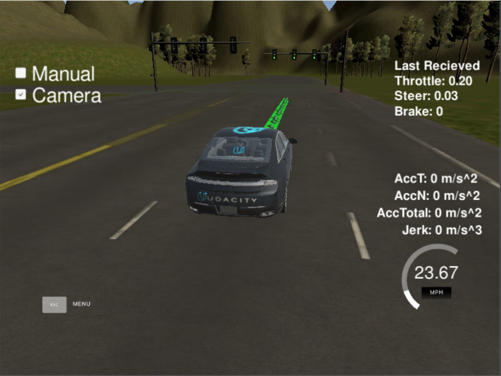
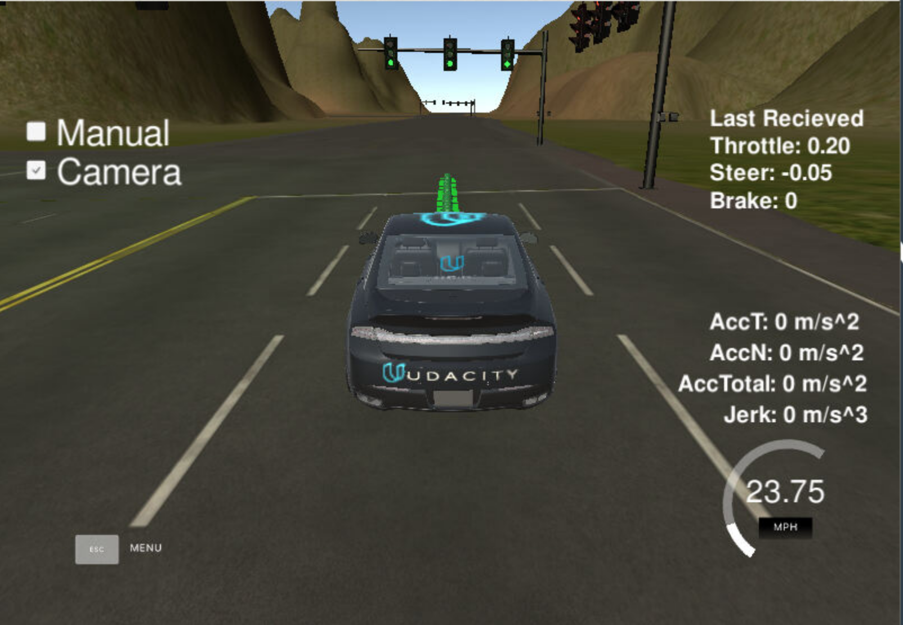
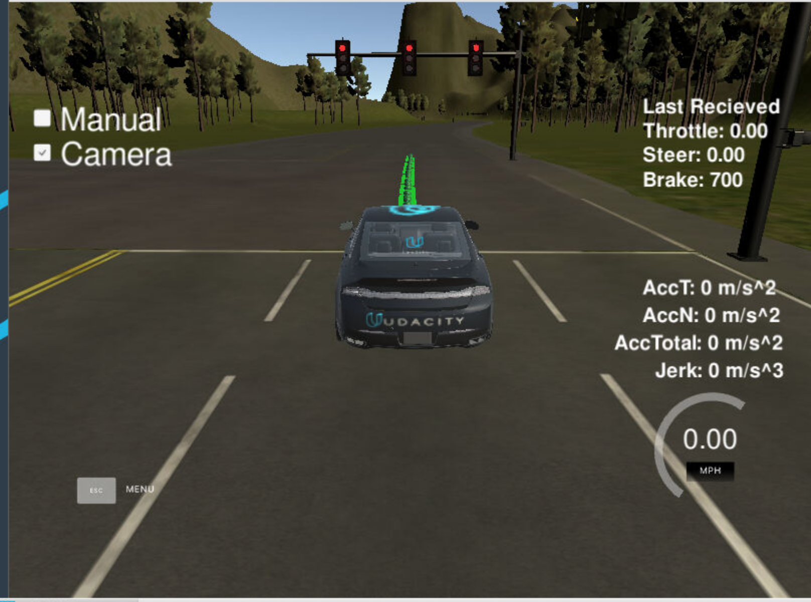

### Autonomous Driving Project
---
This rospy based project contains implementations of the primary subsystems of a self-driving car: perception, planning, and control. The ROS based system is able to drive a car autonomously under controlled conditions. The system was able to  adhere to speed limit and traffic light regulations under test conditions. Because the system is built on the ROS framework, it's highly modular and can accomadate additional features such, as obstacle avoidance. A short demo video of the system driving a car in a Unity simulator can be found [here](./imgs/capstone_demo.mov).

Author: Fabio Flores fflores321@gmail.com

### System Architecture Overview
---
The system uses a pub-sub architecture in which each node subscribes to topics containing input data and publishes to topics that serve as inputs for other nodes. The system has 3 main subsystems: perception, planning, and control. The perception subsystem senses traffic lights and obstacles. The planning subsystem sets and updates waypoint positions and velocities depending on the sensory input. The control subsystem employ the car's drive by wire system to follow waypoints smoothly and safely. The subsystems are able to work cohesively to drive a physical car or a simulator car.


### Traffic Light Classification 
---
To accomplish traffic light detection, I originally trained an SSD classifier, starting with a pretrained (COCO) model from the tensoflow detection model zoo (https://github.com/tensorflow/models/blob/master/research/object_detection/g3doc/detection_model_zoo.md). When I extracted the frozen inference graph and incorporating into the ROS project, classication accuracy was poor. I found that the model needed to be trained for many more training steps to be sufficiently accurate for the application. 

Instead of spending hours training a better model for both the test track and the simulator track, I used the frozen inference graph files from Alex Lechner's [traffic light clasification respository](https://github.com/alex-lechner/Traffic-Light-Classification). The graphs in this repository were trained for many more steps and produced results that satisfied the requirements. 


Green Light               |  Red Light
:-------------------------:|:-------------------------:
  |  


### Installation and Setup
---
Please use **one** of the two installation options, either native **or** docker installation.

### Native Installation

* Be sure that your workstation is running Ubuntu 16.04 Xenial Xerus or Ubuntu 14.04 Trusty Tahir. [Ubuntu downloads can be found here](https://www.ubuntu.com/download/desktop).
* If using a Virtual Machine to install Ubuntu, use the following configuration as minimum:
  * 2 CPU
  * 2 GB system memory
  * 25 GB of free hard drive space

  The Udacity provided virtual machine has ROS and Dataspeed DBW already installed, so you can skip the next two steps if you are using this.

* Follow these instructions to install ROS
  * [ROS Kinetic](http://wiki.ros.org/kinetic/Installation/Ubuntu) if you have Ubuntu 16.04.
  * [ROS Indigo](http://wiki.ros.org/indigo/Installation/Ubuntu) if you have Ubuntu 14.04.
* [Dataspeed DBW](https://bitbucket.org/DataspeedInc/dbw_mkz_ros)
  * Use this option to install the SDK on a workstation that already has ROS installed: [One Line SDK Install (binary)](https://bitbucket.org/DataspeedInc/dbw_mkz_ros/src/81e63fcc335d7b64139d7482017d6a97b405e250/ROS_SETUP.md?fileviewer=file-view-default)
* Download the [Udacity Simulator](https://github.com/udacity/CarND-Capstone/releases).

### Docker Installation
[Install Docker](https://docs.docker.com/engine/installation/)

Build the docker container
```bash
docker build . -t capstone
```

Run the docker file
```bash
docker run -p 4567:4567 -v $PWD:/capstone -v /tmp/log:/root/.ros/ --rm -it capstone
```

### Port Forwarding
To set up port forwarding, please refer to the [instructions from term 2](https://classroom.udacity.com/nanodegrees/nd013/parts/40f38239-66b6-46ec-ae68-03afd8a601c8/modules/0949fca6-b379-42af-a919-ee50aa304e6a/lessons/f758c44c-5e40-4e01-93b5-1a82aa4e044f/concepts/16cf4a78-4fc7-49e1-8621-3450ca938b77)

### Usage

1. Clone the project repository
```bash
git clone https://github.com/udacity/CarND-Capstone.git
```

2. Install python dependencies
```bash
cd CarND-Capstone
pip install -r requirements.txt
```
3. Make and run styx
```bash
cd ros
catkin_make
source devel/setup.sh
roslaunch launch/styx.launch
```
4. Run the simulator

### Real world testing
1. Download [training bag](https://s3-us-west-1.amazonaws.com/udacity-selfdrivingcar/traffic_light_bag_file.zip) that was recorded on the Udacity self-driving car.
2. Unzip the file
```bash
unzip traffic_light_bag_file.zip
```
3. Play the bag file
```bash
rosbag play -l traffic_light_bag_file/traffic_light_training.bag
```
4. Launch your project in site mode
```bash
cd CarND-Capstone/ros
roslaunch launch/site.launch
```
5. Confirm that traffic light detection works on real life images

Directory Structure
---
    .
    ├── data                            # Waypoint Data
    ├── imgs                            # Documenation Images
    └── ros                             # Ros Workspace
        ├── launch                      # Launch files for the simulator and track
        ├── src                         # Code for driving the car
            ├── camera_info_publisher   # Publisher for camera parameters
            ├── dbw_mkz_msgs            # drive-by-wire related message definitions
            ├── sytx                    # Simulator-related code
            ├── styx_msgs               # Simulator message definitions
            ├── tl_detector             # Traffic Light Detection Node 
            ├── twist_controller        # Controller Code
            ├── waypoint_follower       # Waypoint Follower Node
            ├── waypoint_loader         # Waypoint Loader Node 
            ├── waypoint_updater        # Waypoint Updater Node


